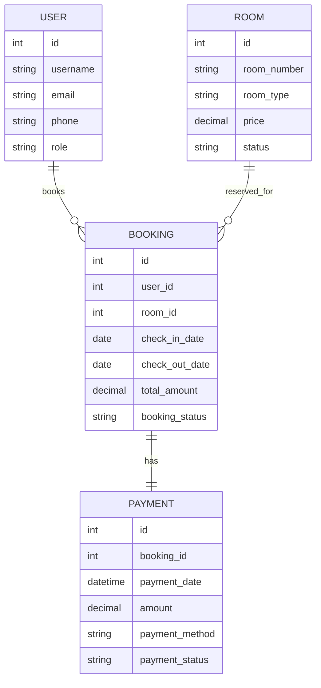

# Hotel Management System (HMS)

This repository contains a Django + SQLite full stack demo for a Hotel Management System, plus DBMS artifacts (ER, queries, procedures, triggers, views) to match academic requirements.

## Project Plan

**Phase 1: Requirements & ER (Day 1)**
1. Confirm user roles (Admin, Receptionist, Customer) and permissions.
2. Finalize entities and relationships.
3. Draw ER diagram and map to tables.

**Phase 2: Database Design (Day 2)**
1. Create normalized tables with PK/FK.
2. Add indexes for room_number, email, booking dates.
3. Write views (available rooms, active bookings).
4. Write trigger and stored procedure examples.

**Phase 3: Backend API (Days 3-4)**
1. Implement auth endpoints (register, login, logout, profile).
2. Room CRUD and filters.
3. Booking flow with transaction.
4. Payment recording.
5. Admin dashboard stats.

**Phase 4: Frontend UI (Day 5)**
1. Minimal single page UI for demo flows.
2. Hook to REST endpoints.
3. Basic styling.

**Phase 5: Testing & Viva Prep (Day 6)**
1. Sample data seeding.
2. Test critical flows.
3. Prepare diagrams and presentation.

## Local Setup

1. Create a virtual environment and install Django.
2. Run migrations.
3. Create a superuser (optional).
4. Run the server.

```bash
python -m venv .venv
source .venv/bin/activate
pip install django
python manage.py makemigrations
python manage.py migrate
python manage.py createsuperuser
python manage.py runserver
```

Open `http://127.0.0.1:8000/` to view the demo UI.

## Modules Implemented

- User Module: register, login, profile
- Room Module: create, update, delete, list
- Booking Module: book, cancel, check-in, check-out
- Payment Module: record payment
- Admin Dashboard: revenue, occupancy, booking stats

## API Endpoints

- `POST /api/register/`
- `POST /api/login/`
- `POST /api/logout/`
- `GET /api/me/`
- `GET /api/rooms/`
- `POST /api/rooms/`
- `PATCH /api/rooms/<id>/`
- `DELETE /api/rooms/<id>/`
- `GET /api/bookings/`
- `POST /api/bookings/`
- `POST /api/bookings/<id>/cancel/`
- `POST /api/bookings/<id>/checkin/`
- `POST /api/bookings/<id>/checkout/`
- `POST /api/payments/`
- `GET /api/dashboard/`

## ER Diagram (Mermaid)



## DBMS Artifacts

See `dbms_examples.sql` for:
- Indexes
- Views
- Stored procedure
- Trigger
- Transaction example

## Notes

This demo uses Django sessions for auth and SQLite for development. You can switch to MySQL by updating `hms/settings.py`.
